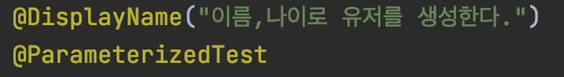

## @Bean, @Component
둘 다 bean 객체를 등록하는 역할을 하는 어노테이션. 하지만 사용하는 방법과 용도에 차이가 있다.

### @Bean

- 메서드, 어노테이션에만 선언 가능.
- 메서드가 반환하는 객체를 빈 객체로 등록.
- 사용자가 프로퍼티를 변경해서 생성한 인스턴스를 스프링에게 관리하라고 맡기는 것.
- 주로 개발자가 직접 건드릴 수 없는 외부 라이브러리 클래스를 빈 객체로 등록할 때 사용됨.

### @Component

- 클래스에만 선언 가능.
- AnnotationConfigApplicationContext
- 클래스를 스프링더러 알아서 인스턴스 생성한 후에 빈으로 등록 하라고 맡기는 것.


## Dispatcher Servlet

[Dispatcher Servlet이 정적리소스를 처리하는 방법](http://egloos.zum.com/springmvc/v/504151)

Servlet Container에서 HTTP프로토콜을 통해 들어오는 모든 요청을 프레젠테이션 계층의 제일앞에 둬서 중앙집중식으로 처리해주는 프론트 컨트롤러(Front Controller)


### 기존

- 스프링이 없을 때는 서블릿 객체를 생성하고 web.xml에 일일히 등록해줘야 했다.
- 서블릿을 컨트롤러로 직접 사용하는건 여러 단점이 있었다.
    - 서블릿 하나 당 하나의 경로(URL)만 처리할 수 있음.
    - Servlet 객체는 HttpServlet를 확장한 객체이기 때문에 HttpServlet 기능을 필수로 Override해야했다.
    - 중복작업이 많았다. 모든 서블릿이 공통으로 처리할 작업 등의 중복을 제거하기가 힘들다.

### Spring 이후 (Dispatcher Servlet 등장)

- @Controller 등장. 컨트롤러는 더 이상 HttpServlet을 확장하지 않고, POJO에 어노테이션을 붙여 사용한다.
- 컨트롤러를 web.xml 에 등록하지 않아도 된다. 컨트롤러의 매핑은 DispatcherServlet이 담당하기 때문.
- 공통으로 처리해야하는 작업을 Dispatcher Servlet이 담당하기 때문에 중복이 매우 줄고, 컨트롤러는 `요청을 받고 응답을 처리한다` 라는 본연의 임무에 집중할 수 있다.

[https://joont92.github.io/spring/HandlerMapping-HandlerAdapter-HandlerInterceptor/](https://joont92.github.io/spring/HandlerMapping-HandlerAdapter-HandlerInterceptor/)


## HandlerAdapter

HandlerMapping을 통해 찾은 컨트롤러를 직접 실행하는 기능을 수행.

### Handler를 직접 호출하지 않고 HandlerAdapter를 사용하는 이유

**여러 종류의 컨트롤러를 동일한 방식으로 처리하기 위해!**

스프링이 지원하는 컨트롤러는 4가지 종류가 있다.

1. javax.servlet.Servlet 인터페이스 구현체
2. HttpRequestHandler 인터페이스 구현체
3. Controller 인터페이스 구현체
4. @Controller, @RequestMapping

DispatcherServlet은 핸들러 객체의 실제 타입에 상관 없이, 실행 결과를 ModelAndView라는 타입으로만 받을 수 있으면 되는데, ModeAndView를 리턴하지 않는 객체도 있다. 이 때, **Handler의 처리 결과를 ModelAndView로 변환해주는 객체가 필요**하며, HandlerAdapter가 바로 이 변환을 수행해준다.

### HandlerAdapter의 흐름

1. HandlerMapping 으로 찾은 오브젝트(컨트롤러)를 등록된 HandlerAdaptor 들의 supports 메서드에 대입하며 지원 여부를 살핌.

    DisptcherServlet의 getHandlerAdapter 메서드

    

    - 우리가 사용하는 핸들러어댑터는 주로 RequestMappingHandlerAdapter인데, 이 어댑터의 supports 메서드는 항상 true 리턴한다. `왜 그런진 아직 모름`

        RequestMappingHandlerAdapter의 supportsInternal 메서드 (supports의 내부 메서드)

        

2. 부합할 경우 handler 메서드를 실행하여 ModelAndView 를 리턴.
    - ModelAndView 리턴 대신 null을 리턴할 경우 DispatcherServlet은 뷰를 호출하는 작업을 생략한다고 함: [출처](https://joont92.github.io/spring/HandlerMapping-HandlerAdapter-HandlerInterceptor/)

        HandlerAdapter의 handle 메서드: 핸들러 메서드가 응답을 직접 처리했다면 null 리턴

        

스프링 MVC가 지원하는 컨트롤러는 총 4개이므로, 핸들러 어댑터도 4개이다.

### RequestMappingHandlerAdapter

스프링 3.0 이후부터 주로 쓰이는 컨트롤러

클래스와 메서드에 붙은 애노테이션, 메서드 이름, 파타미터, 리턴타입에 대한 규칙 등을 조합하고 분석해서 컨트롤러를 선별.


## 해시, 키 스트레칭, 솔팅

[https://st-lab.tistory.com/100](https://st-lab.tistory.com/100)

**해시**

- 비밀번호는 단방향 알고리즘으로 암호화하여 저장해야 한다.
    - 단방향 알고리즘은 복호화 할 수 없으며 해쉬 함수라고 부른다.
    - 해쉬 함수를 통해 나온 결과는 다이제스트, 해시 값, 해시 코드, 체크섬 또는 해시 등으로 부른다.
- 해쉬 함수는 암호학적 해쉬 함수와 비암호학적 해쉬 함수로 나뉘는데 비밀번호 저장에는 암호학적 해쉬 함수를 사용한다.
    - 암호학적 해쉬 함수는 MD-5, SHA-1, SHA-256, SHA-512 등 여러 종류가 있다.
- 해시 함수의 한계점
    - 동일한 메시지는 동일한 다이제스트를 갖는다.
        - 해커들은 미리 여러 값들을 해시함수에 대입해보면서 구한 다이제스트들을 모아놓는다. 이러한 다이제스트들의 테이블을 우리는 **레인보우 테이블(Rainbow Table)**이라고 한다.
    - 

### 해시 함수 보완하기

**키 스트레칭**


- 해시함수를 통해 얻은 **다이제스트를 여러번 해시함수로 돌리는 것**이다.
- 몇 번을 할지는 서버만 알고 있다.
- 설령 몇 번 돌렸는지 알아도 레인보우 테이블로 복호화하기 힘들다.
- 사용자의 경우 패스워드를 입력하고 일치여부를 확인 할 때 0.2 ~ 0.5 초만 걸려도 크게 문제가 없다. 그러나 앞서 말했듯이 임의의 문자열을 무차별 대입하는 해커 입장에서는 1초에 10억번의 다이제스트를 얻을 수 있었으나 다이제스트를 얻기 까지의 시간을 지연시켜 이제는 한 횟수당 0.2 ~ 0.5초가 걸리기 때문에 매우 치명적이다.
- 브루트 포스를 무력화 할 수 있다.

**솔트**


- 키 스트레칭만으론 부족하다. 같은 비밀번호를 사용하는 사용자들이 있다면 하나의 결과를 갖고도 다수 사용자의 password 를 알아낼 수 있다. 솔트는 **해시함수를 돌리기 전에 원문에 임의의 문자열을 덧붙이는 것**이다.
- **사용자마다 다른 Salt 를 사용**한다면 설령 같은 비밀번호더라도 다이제스트의 값은 다르다. 이는 결국 한 명의 패스워드가 유출되더라도 같은 비밀번호를 사용하는 다른 사용자는 비교적 안전하다는 의미기도 하다. 즉, **같은 패스워드를 사용하더라도** salting 된 문자열은 서로 다르기 때문에 **각 사용자의 다이제스트는 서로 다른 값으로 저장**될 것이다.
- 솔트의 가장 큰 목적은 해당 솔트의 레인보우 테이블 새로 생성하여 만들기 위해서는 엄청나게 큰 데이터를 필요로 하기 때문에 자연스럽게 레인보우 테이블 생성을 방지하는 역할을 해주기도 한다.

**두 가지 방법을 혼용**


## @ParameterizedTest 테스트 이름 설정

[https://stackoverflow.com/questions/57892989/generating-display-names-for-parameterizedtest-in-junit-5](https://stackoverflow.com/questions/57892989/generating-display-names-for-parameterizedtest-in-junit-5)

---

테스트가 Junit5의 `@ParameterizedTest` 일 때는 `@DisplayName` 만 설정해선 기대처럼 테스트의 이름이 실행창에 보여지지 않는다.




---

`@ParameterizedTest` 의 `name` 을 통해 테스트이름을 커스텀할 수 있다.


---

테스트에 입력되는 인자마다 다르게 이름을 설정할 수도 있다. `@ParameterizedTest` 에서 제공하는 `placeholder` 들을 활용하여 `name`에 입력하면 됨.

`placeholder` 목록

- `DISPLAY_NAME_PLACEHOLDER`: {displayName}
- `INDEX_PLACEHOLDER`: {index}
- `ARGUMENTS_PLACEHOLDER`: {arguments}
- `ARGUMENTS_WITH_NAMES_PLACEHOLDER`: {argumentsWithNames}
- `DEFAULT_DISPLAY_NAME`: [{index}] {argumentsWithNames}
- 인자 인덱스 placeholder: {0}, {1} ...

---

### 예시

```java
    @DisplayName("뭔가를 테스트한다:")
//    @ParameterizedTest()
//    @ParameterizedTest(name = "{displayName} {index} {0} {1}")
//    @ParameterizedTest(name = DEFAULT_DISPLAY_NAME +  INDEX_PLACEHOLDER + " {0} {1}")
//    @ParameterizedTest(name = ARGUMENTS_PLACEHOLDER)
    @ParameterizedTest(name = ARGUMENTS_WITH_NAMES_PLACEHOLDER)
    @MethodSource("testSource")
    void test(int age, String name) {
    assertThat(age).isLessThan(100);
    assertThat(name).isNotNull();
    }

    private static Stream<Arguments> testSource() {
        return Stream.of(
                Arguments.of(20, "서민정"),
                Arguments.of(30, "임나성"),
                Arguments.of(10, "김주원")
        );
    }
```

```java
@ParameterizedTest(name = "거리에 따른 요금을 계산한다. {0}km -> {1}원")
@MethodSource("calculateSource")
void calculate(int distance, int expectedFare) {
    // given
    FareByDistance fareByDistance = new FareByDistance(distance);

    // when
    int fare = fareByDistance.calculate();

    // then
    assertThat(fare).isEqualTo(expectedFare);
}

private static Stream<Arguments> calculateSource() {
    return Stream.of(
            Arguments.of(10, 1250),
            Arguments.of(11, 1350),
            Arguments.of(15, 1350),
            Arguments.of(16, 1450),
            Arguments.of(50, 2050),
            Arguments.of(51, 2150),
            Arguments.of(58, 2150),
            Arguments.of(59, 2250)
    );
}
```

결과


## 리버스 프록시
리버스 프록시는 프록시의 일종. 서버의 대리자로서 실제 서버가 누구인지 감추는 역할을 수행하는 서버이다.

(1)클라이언트가 서버를 호출할 때 리버스 프록시를 호출하게 되고 (2)리버스 프록시가 서버를 요청하여 받은 응답을 클라이언트에게 전달하는 방식.

### 장점

1. 로드 밸런싱
    - 부하를 분산하여 서버의 가용성, 응답시간을 높일 수 있다.
2. 중앙 집중식 log 작성
3. 캐싱
4. 보안
5. 확장 용이성
    - 추후에 더 많은 사용자에 대해 서버를 확장할 때도 보다 쉽게 확장 가능

## Test Double

### Test Double의 역할

- 테스트 대상 코드를 격리합니다.
- 테스트 속도를 개선합니다.
- 예측 불가능한 실행 요소를 제거합니다.

### Test Double의 종류

1. Dummy
2. Stub
3. Spy
4. Mock
5. Fake

### Dummy

동작하지 않아도 테스트에는 영향을 미치지 않는 객체를 Dummy 객체라고 한다.

- 가장 기본적인 테스트 더블
- 단지 인스턴트화 된 객체가 필요하고, 해당 객체의 기능까지 필요하지 않은 경우에 사용
- 해당 dummy객체의 메서드가 호출되었을 때 정상 동작은 보장하지 않음
- **구현을 제외한 인터페이스 or 기본 클래스의 파생 객체**
- **객체는 전달되지만 사용되지 않는 객체**

### Stub

- Dummy 객체가 실제로 동작하는 것 처럼 보이게 만들어 놓은 객체이다.
- 인터페이스 또는 기본 클래스가 최소한으로 구현된 상태이다.
- 테스트에서 호출된 요청에 대해 미리 준비해둔 결과를 제공한다.

### Spy

- Stub의 역할을 가지면서 호출된 내용에 대해 약간의 정보를 기록한다.
- 테스트 더블로 구현된 객체에 자기 자신이 호출 되었을 때 확인이 필요한 부분을 기록하도록 구현한다.
- 실제 객체처럼 동작시킬 수도 있고, 필요한 부분에 대해서는 Stub로 만들어서 동작을 지정할 수도 있다.

### Mock

- 호출에 대한 기대를 명세하고 내용에 따라 동작하도록 프로그래밍 된 객체이다.

### Fake

동작은 하지만 실제 사용되는 객체처럼 정교하게 동작하지는 않는 객체를 말한다.

- 복잡한 로직이나 객체 내부에서 필요로 하는 다른 외부 객체들의 동작을 단순화하여 구현한 객체이다.
- 동작의 구현을 가지고 있지만 실제 프로덕션에는 적합하지 않은 객체이다.

## Mock의 단점
지하철미션에서 Mockito를 사용하여 테스트를 작성해보았고 제가 느낀 Mock의 단점을 정리해봤습니다.

### 1. **테스트의 목적을 달성하기 힘들다.**

1. 테스트하기 어려운 부분을 모킹으로 대체
2. mock으로 대체된 부분이 실제 프로덕션에서는 잘못 동작
3. 테스트는 깨지지 않음

**결론 - 프로덕션이 제대로 동작하는지 테스트가 보증할 수 없음**

### 2. **TDD 사이클(레드,그린,리팩터링)을 지킬 수 없다.**

위의 `테스트의 목적을 달성하기 힘들다` 에서 확장되는 내용입니다.

첫 단계인 실패하는 테스트를 작성하기 힘듭니다.TDD는 프로덕션보다 테스트를 먼저 작성해야하는데,모킹을 사용하면 `테스트 코드`가 `프로덕션 코드`의 내부 구현을 알 수 밖에 없습니다.**결국 내부구현에 끌려가는 테스트코드가 만들어질 수 있다고 생각해요!**

TTD사이클의 세번째 단계인 리팩터링 파트를 수행할 수 없습니다.TDD에서는 테스트를 건들지 않고 리팩터링을 하고, 리팩터링 후 테스트가 통과해야만 리팩터링이 성공적이라는걸 알 수 있죠.리팩터링 과정에서 모킹한 부분을 변경(혹은 더 이상 모킹한 부분을 사용하지 않음)한다면, 테스트는 실패할 수 있습니다.

여기서 문제가 발생합니다.

첫번째는 **리팩터링한 코드에 문제가 없더라도 테스트가 실패할 수 있다는 것입니다.**
두번째는 **만약 테스트에 문제가 있다면, 테스트를 통과하기 위해 리팩터링한 코드에 맞게 테스트코드의 모킹도 같이 변경해야 한다는 것입니다.**

리팩터링 단계에서는 프로덕션의 코드만 수정되어야 하는데 테스트가 같이 수정되면 TDD 사이클에 위배됩니다!
